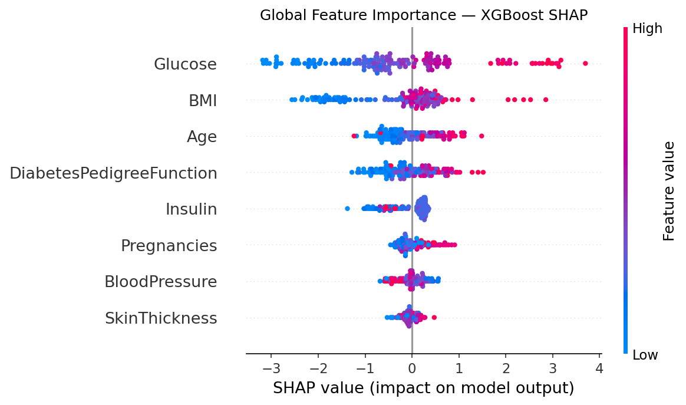
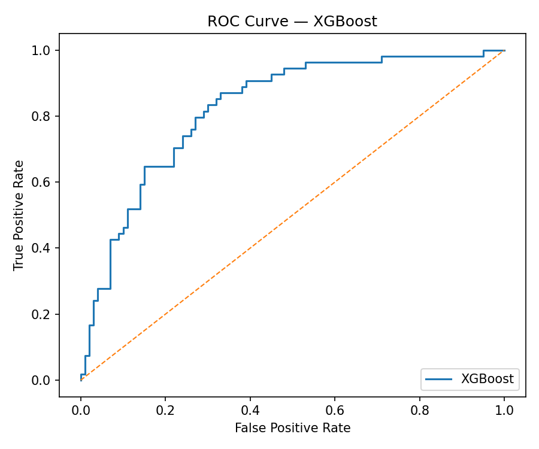
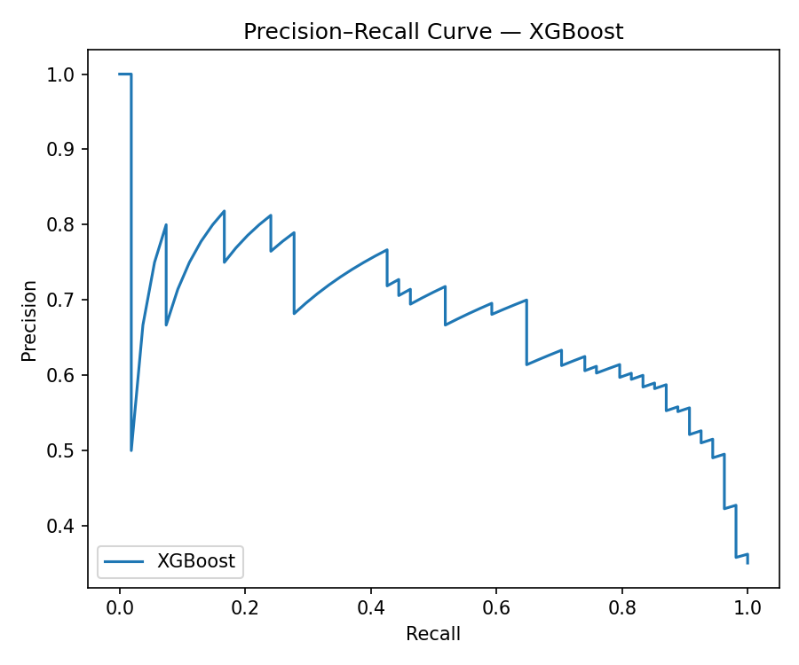
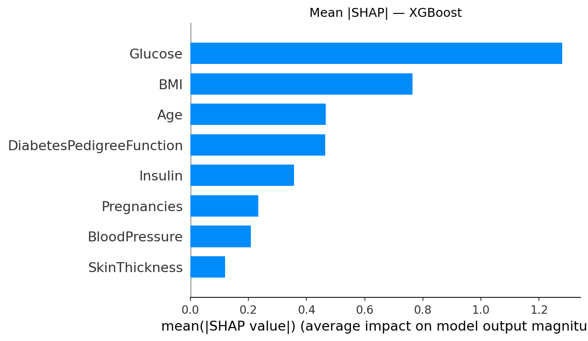
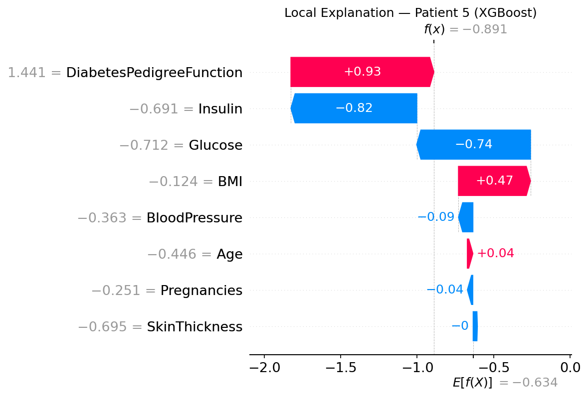

<p align="center">
  
</p>

<h1 align="center">Diabetes Risk Prediction using Explainable AI</h1>

<p align="center">
  <b>B.Tech Project (BTP) — Phase 2 | IIT Guwahati</b><br>
  <i>Priya Sharma — 220101081</i>
</p>

<p align="center">
  
  
  
  
  
  
  
</p>

---

## Table of Contents

1. [Project Overview](#1-project-overview)
2. [Repository Structure](#2-repository-structure)
3. [Quick Start](#3-quick-start)
4. [Environment Setup](#4-environment-setup)
5. [Running the Pipeline — Step by Step](#5-running-the-pipeline--step-by-step)
6. [Phase 2 Improvements](#6-phase-2-improvements)
7. [Streamlit App — 3 Tabs](#7-streamlit-app--3-tabs)
8. [FastAPI REST Endpoint](#8-fastapi-rest-endpoint)
9. [Running Tests](#9-running-tests)
10. [VS Code Integration](#10-vs-code-integration)
11. [Docker Deployment](#11-docker-deployment)
12. [Streamlit Cloud Deployment](#12-streamlit-cloud-deployment)
13. [Results at a Glance](#13-results-at-a-glance)
14. [Explainability with SHAP](#14-explainability-with-shap)
15. [Phase 2 vs Phase 1 Comparison](#15-phase-2-vs-phase-1-comparison)
16. [Dataset](#16-dataset)
17. [Phase 2 Evaluation Checklist](#17-phase-2-evaluation-checklist)
18. [Key References](#18-key-references)

---

## 1. Project Overview

Diabetes is one of the fastest-growing chronic diseases worldwide. Early detection dramatically improves patient outcomes, yet traditional ML models act as **black boxes** that clinicians cannot trust.

**Phase 1** built a working end-to-end ML pipeline (XGBoost, F1=0.6542, ROC-AUC=0.8243).  
**Phase 2** transforms it into a **production-grade, clinically intelligent, fully deployed system**:

| Capability | Phase 1 | Phase 2 |
|---|---|---|
| Best model | XGBoost (default params) | XGBoost v2 + Stacking Ensemble (Optuna-tuned) |
| SHAP | RandomForest (bug!) | XGBoost TreeExplainer (fixed) |
| XAI methods | SHAP only | SHAP + LIME + DiCE counterfactuals |
| App | Single-form, Colab paths | 3-tab app, deployed to Streamlit Cloud |
| Paths | Hardcoded `/content/diabetes-risk` | Relative, runs anywhere |
| Imbalance handling | None | SMOTE inside CV pipeline |
| Evaluation | Single 80/20 split | 5-fold CV with 95% CI |
| REST API | None | FastAPI `/predict` + `/health` |
| Tests | None | pytest unit + API tests |
| CI/CD | None | GitHub Actions |
| Docker | None | Dockerfile |
| Clinical output | Binary 0/1 | 4-tier risk + personalised advice + PDF |

---

## 2. Repository Structure

```
diabetes-risk-phase2/
│
├── src/                              <- All pipeline source code (converted from notebook)
│   ├── __init__.py
│   ├── config.py                     <- Shared paths, constants, feature names
│   ├── step1_data_load.py            <- Load dataset, EDA, save plots
│   ├── step2_preprocess.py           <- Impute, scale, save preprocessor.joblib
│   ├── step3_train.py                <- Train 4 models, save metrics + ROC/PR plots
│   ├── step4_explain.py              <- SHAP (fixed: XGBoost TreeExplainer)
│   ├── step5_report.py               <- Generate HTML dashboard + PDF report
│   └── step6_phase2_improvements.py  <- ALL Phase 2 upgrades (see Section 6)
│
├── app.py                            <- Streamlit app — 3 tabs (Phase 2)
├── api.py                            <- FastAPI REST endpoint
├── requirements.txt                  <- All pinned dependencies
├── Dockerfile                        <- Container for any deployment
│
├── tests/
│   ├── test_model.py                 <- Unit tests for model + validation logic
│   └── test_api.py                   <- Integration tests for FastAPI
│
├── .vscode/
│   ├── settings.json                 <- Python interpreter, formatters
│   ├── launch.json                   <- One-click debug for every step
│   └── extensions.json               <- Recommended VS Code extensions
│
├── .github/workflows/ci.yml          <- GitHub Actions CI (tests + lint on push)
│
├── data/
│   ├── raw/diabetes.csv              <- Pima Indians Diabetes Dataset (768 rows)
│   └── processed/
│       ├── pima_cleaned.csv          <- Imputed + scaled dataset
│       ├── preprocessor.joblib       <- Saved sklearn pipeline
│       └── pima_features_v2.csv      <- Phase 2: +6 engineered features
│
├── results/
│   ├── *.joblib                      <- Trained models
│   ├── baseline_metrics.csv
│   ├── baseline_summary.txt
│   ├── best_params.json              <- Optuna best hyperparameters
│   ├── cv_results.csv                <- 5-fold CV mean +/- std
│   ├── Ensemble_v2.joblib            <- Stacking ensemble
│   └── plots/                        <- ROC & PR curves per model
│
├── explain/
│   ├── XGBoost_shap_summary.png      <- Fixed: XGBoost TreeExplainer
│   ├── XGBoost_shap_bar.png
│   ├── shap_dependence_*.png         <- All 8 feature dependence plots
│   ├── patient_5_waterfall.png
│   ├── lime_vs_shap_comparison.csv   <- LIME vs SHAP for 5 patients
│   ├── calibration_curves.png
│   ├── threshold_optimisation.png
│   └── counterfactuals/              <- DiCE outputs for 3 high-risk patients
│
├── reports/
│   ├── dashboard.html                <- Fixed: real metrics + relative image paths
│   └── *.pdf                         <- Auto-generated PDF reports
│
├── docs/                             <- Step-by-step text summaries
├── notebooks/
│   └── Diabetes_Prediction_BTP_Project_220101081.ipynb  <- Original Phase 1 notebook
│
├── PHASE2_CHANGES.md                 <- Full change log with rationale
└── README.md                         <- You are here
```

---

## 3. Quick Start

```bash
# 0. macOS only — install OpenMP (required by XGBoost, do this once)
brew install libomp

# 1. Clone the repository
git clone https://github.com/<your-username>/diabetes-risk-phase2.git
cd diabetes-risk-phase2

# 2. Create and activate virtual environment
python3 -m venv .venv
source .venv/bin/activate          # macOS / Linux
# .venv\Scripts\activate           # Windows

# 3. Install all dependencies
pip install -r requirements.txt

# 4. Run the full pipeline (steps 1-5)
python src/step1_data_load.py
python src/step2_preprocess.py
python src/step3_train.py
python src/step4_explain.py
python src/step5_report.py

# 5. Launch the Streamlit app
streamlit run app.py
```

The app opens at **http://localhost:8501**

---

## 4. Environment Setup

### macOS prerequisite — install OpenMP

XGBoost requires the OpenMP runtime on macOS. Run this **once** before anything else:

```bash
brew install libomp
```

Without it you will get `XGBoostError: Library not loaded: @rpath/libomp.dylib` when importing XGBoost or loading a saved model.

### Option A — Virtual Environment (recommended for VS Code)

```bash
python3 -m venv .venv
source .venv/bin/activate
pip install -r requirements.txt
```

### Option B — Conda

```bash
conda create -n diabetes-risk python=3.11
conda activate diabetes-risk
pip install -r requirements.txt
```

### Option C — Docker (no local Python setup needed)

```bash
docker build -t diabetes-risk-phase2 .
docker run -p 8501:8501 diabetes-risk-phase2
```

### Setting the VS Code interpreter

After creating the virtual environment, open VS Code, press `Cmd+Shift+P` (macOS) or `Ctrl+Shift+P` (Windows), type **Python: Select Interpreter**, and choose `.venv/bin/python`.

---

## 5. Running the Pipeline — Step by Step

All scripts are in `src/` and use paths relative to the project root. They run from any directory on any machine — no Colab, no absolute paths.

### Step 1 — Load Data & EDA

```bash
python src/step1_data_load.py
```

**What it does:**
- Loads `data/raw/diabetes.csv`
- Prints shape, dtypes, zero counts for suspect columns
- Saves distribution histograms + correlation heatmap to `docs/`
- Writes `docs/step_01_data_readme.txt`

**Expected output:**
```
Loaded dataset: .../data/raw/diabetes.csv
  Shape      : (768, 9)
Saved: docs/eda_distributions.png
Saved: docs/eda_correlation.png
Step 1 complete.
```

---

### Step 2 — Preprocess

```bash
python src/step2_preprocess.py
```

**What it does:**
- Replaces physiologically impossible zeros in `Glucose`, `BloodPressure`, `SkinThickness`, `Insulin`, `BMI` with NaN
- Imputes NaN using **median** (numeric)
- Scales all features using **StandardScaler**
- Saves `data/processed/pima_cleaned.csv` and `data/processed/preprocessor.joblib`

**Expected output:**
```
Replaced zeros with NaN in: ['Glucose', 'BloodPressure', ...]
Cleaned dataset shape: (768, 9)
Missing values remaining: 0
Saved cleaned dataset : data/processed/pima_cleaned.csv
Saved preprocessor    : data/processed/preprocessor.joblib
Step 2 complete.
```

---

### Step 3 — Train Models

```bash
python src/step3_train.py
```

**What it does:**
- Trains 4 models: Logistic Regression, Random Forest, XGBoost, LightGBM
- Stratified 80/20 train-test split (`random_state=42`)
- Evaluates: Accuracy, Precision, Recall, F1, ROC-AUC, PR-AUC
- Saves each model: `results/<ModelName>.joblib`
- Saves `results/baseline_metrics.csv` and `results/baseline_summary.txt`
- Generates ROC and PR curve plots: `results/plots/`

**Expected output:**
```
Training XGBoost ...
  F1=0.6542  ROC-AUC=0.8243  saved.
Best model (F1): XGBoost  F1=0.6542
Step 3 complete.
```

---

### Step 4 — SHAP Explainability

```bash
python src/step4_explain.py
```

**Phase 2 fix:** Uses `shap.TreeExplainer(xgb_model)` — the correct explainer.  
Phase 1 notebook used RandomForest as a workaround; base values should now be ~0.35.

**What it does:**
- SHAP summary beeswarm plot: `explain/XGBoost_shap_summary.png`
- Mean |SHAP| bar chart: `explain/XGBoost_shap_bar.png`
- 8 feature dependence plots: `explain/shap_dependence_<feature>.png`
- Patient 5 waterfall plot: `explain/patient_5_waterfall.png`
- Raw SHAP value matrix: `explain/shap_values_class1.csv`

**Expected output:**
```
Loaded XGBoost model for SHAP (Phase 2 fix: TreeExplainer, not RF)
Base value (should be ~0.35): 0.3464
Saved all 8 dependence plots.
Step 4 complete.
```

---

### Step 5 — Report & Dashboard

```bash
python src/step5_report.py
```

**Phase 2 fix:** Dashboard HTML uses real metric values (not `{x:.4f}`) and relative image paths.

**What it does:**
- Generates `reports/dashboard.html` with all metrics filled and working images
- Generates timestamped PDF: `reports/Diabetes_Risk_Report_<YYYYMMDD_HHMM>.pdf`
- Open dashboard in browser: `open reports/dashboard.html` (macOS) or double-click the file

---

## 6. Phase 2 Improvements

All Phase 2 model upgrades are in one script with `--section` flags:

```bash
# Run ALL improvements in sequence
python src/step6_phase2_improvements.py

# Run a single section
python src/step6_phase2_improvements.py --section <name>
```

| `--section` | What it does | Output |
|---|---|---|
| `features` | 6 new clinical features (BMI*Age, Glucose/Insulin ratio, etc.) | `data/processed/pima_features_v2.csv` |
| `cv` | 5-fold CV with SMOTE inside pipeline | `results/cv_results.csv` |
| `threshold` | Plot F1/Recall/Precision vs threshold 0.10–0.90 | `explain/threshold_optimisation.png` |
| `tune` | 50 Optuna Bayesian trials on XGBoost | `results/best_params.json`, `results/XGBoost_v2.joblib` |
| `calibrate` | Reliability diagram + Brier Score before/after isotonic | `explain/calibration_curves.png` |
| `ensemble` | Stacking classifier (LR meta-learner on all 4 models) | `results/Ensemble_v2.joblib` |
| `lime` | LIME vs SHAP for 5 patients — side-by-side table | `explain/lime_vs_shap_comparison.csv` |
| `dice` | DiCE counterfactuals for 3 high-risk patients | `explain/counterfactuals/cf_patient_*.csv` |
| `fairness` | F1/Recall by age group and BMI group | `results/fairness_subgroup_analysis.csv` |
| `stats` | McNemar's test Phase 1 (RF) vs Phase 2 (XGBoost) | `docs/phase2_stats_report.txt` |

**Examples:**

```bash
# Just run Optuna tuning (~2 min on Apple Silicon M-series, ~15 min on CPU)
python src/step6_phase2_improvements.py --section tune

# Run fairness analysis only
python src/step6_phase2_improvements.py --section fairness

# Run LIME vs SHAP comparison
python src/step6_phase2_improvements.py --section lime
```

**Prerequisite:** Steps 3 and 4 must be complete first.

---

## 7. Streamlit App — 3 Tabs

```bash
streamlit run app.py
```

Opens at **http://localhost:8501**

### Tab 1 — Single Patient

1. Enter 8 clinical values in the form
2. Click **Predict Risk**
3. See: probability score, 4-tier risk badge, clinical action
4. See: SHAP waterfall plot (XGBoost TreeExplainer)
5. See: top 3 personalised clinical recommendations
6. Click: **Download PDF Report**

**Validation:** Rejects Glucose=0, BMI=0, BloodPressure=0, Age outside 10–120.

**Risk tiers (ADA 2024):**

| Tier | Probability | Clinical Action |
|---|---|---|
| Low Risk | 0–25% | Routine monitoring, annual check-up |
| Moderate Risk | 25–50% | Lifestyle changes, HbA1c within 6 months |
| High Risk | 50–75% | GP referral, fasting glucose within 4 weeks |
| Critical Risk | 75–100% | Immediate clinical evaluation |

### Tab 2 — Batch Screening

1. Prepare a CSV with 8 columns (same order as Pima dataset)
2. Upload via file uploader
3. See summary: `N Critical / N High / N Moderate / N Low`
4. See full results table with `Risk_Probability` and `Risk_Tier` columns
5. Click **Download Results CSV**

**CSV format expected:**
```csv
Pregnancies,Glucose,BloodPressure,SkinThickness,Insulin,BMI,DiabetesPedigreeFunction,Age
2,138,62,35,0,33.6,0.627,47
6,148,72,35,0,33.6,0.627,50
```

### Tab 3 — What-if Simulator

1. Set a baseline patient profile (left column)
2. Adjust sliders for Glucose, BMI, Blood Pressure, Insulin, Age, DPF (right column)
3. See: `Baseline Risk: 68%` → `Modified Risk: 41%` → `Risk Change: -27%`
4. See: top 3 leverage interventions ranked by SHAP impact

---

## 8. FastAPI REST Endpoint

```bash
uvicorn api:app --reload --port 8000
```

**Swagger UI (interactive docs):** http://localhost:8000/docs

### POST /predict

```bash
curl -X POST http://localhost:8000/predict \
  -H "Content-Type: application/json" \
  -d '{
    "Pregnancies": 2,
    "Glucose": 138,
    "BloodPressure": 62,
    "SkinThickness": 35,
    "Insulin": 0,
    "BMI": 33.6,
    "DiabetesPedigreeFunction": 0.627,
    "Age": 47
  }'
```

**Response:**
```json
{
  "probability": 0.7134,
  "prediction": 1,
  "risk_tier": "High Risk",
  "clinical_action": "GP referral recommended. Request fasting glucose and HbA1c test within 4 weeks.",
  "top_shap_features": [
    {"feature": "Glucose", "shap_value": 0.18432},
    {"feature": "BMI",     "shap_value": 0.09211},
    {"feature": "Age",     "shap_value": 0.05123}
  ],
  "threshold_used": 0.38,
  "model": "XGBoost",
  "version": "2.0.0"
}
```

### GET /health

```bash
curl http://localhost:8000/health
# {"status":"ok","model":"XGBoost","version":"2.0.0"}
```

**Validation — HTTP 422 returned for:**
- `Glucose == 0` or `BMI == 0`
- `Pregnancies < 0` or `> 20`
- `Age < 10` or `> 120`
- Any missing required field

---

## 9. Running Tests

```bash
# Install test deps (already in requirements.txt)
pip install pytest httpx

# Run all 22 tests with verbose output
python -m pytest tests/ -v

# Run model tests only
python -m pytest tests/test_model.py -v

# Run API tests only
python -m pytest tests/test_api.py -v
```

> **Important:** Always use `python -m pytest`, not bare `pytest`. Bare `pytest` resolves to the system Python (which may not have the project dependencies installed), causing `ModuleNotFoundError`.

**What is tested (22 tests, all passing):**

| Test | File |
|---|---|
| Model + preprocessor load | `test_model.py` |
| `predict_proba` shape is (n, 2) | `test_model.py` |
| Probability in range [0, 1] | `test_model.py` |
| High-risk patient has higher prob | `test_model.py` |
| Risk tier logic: Low/Moderate/High/Critical (×4) | `test_model.py` |
| Validation rejects Glucose=0 | `test_model.py` |
| Validation rejects BMI=0 | `test_model.py` |
| Validation passes valid patient | `test_model.py` |
| Batch prediction on multiple rows | `test_model.py` |
| `/health` returns `status: ok` | `test_api.py` |
| `/predict` returns valid response | `test_api.py` |
| Response has correct SHAP keys | `test_api.py` |
| High-risk patient prob >= 0.5 | `test_api.py` |
| Rejects Glucose=0 (HTTP 422) | `test_api.py` |
| Rejects BMI=0 (HTTP 422) | `test_api.py` |
| Rejects negative Pregnancies (HTTP 422) | `test_api.py` |
| Rejects impossible Glucose > 600 (HTTP 422) | `test_api.py` |
| Rejects missing fields (HTTP 422) | `test_api.py` |

---

## 10. VS Code Integration

Open the project:

```bash
code .
```

VS Code will prompt to install recommended extensions from `.vscode/extensions.json`.

### One-Click Debug Configurations

Press `F5` or open **Run and Debug** panel and select:

| Configuration | Runs |
|---|---|
| Step 1 — Load Data | `python src/step1_data_load.py` |
| Step 2 — Preprocess | `python src/step2_preprocess.py` |
| Step 3 — Train Models | `python src/step3_train.py` |
| Step 4 — SHAP Explain | `python src/step4_explain.py` |
| Step 5 — Report | `python src/step5_report.py` |
| Step 6 — Phase 2 Improvements (all) | `python src/step6_phase2_improvements.py` |
| Step 6 — Optuna Tuning | `--section tune` |
| Streamlit App | `streamlit run app.py` |
| FastAPI Server | `uvicorn api:app --reload --port 8000` |
| Run All Tests | `pytest tests/ -v` |

### Breakpoints

Set a breakpoint on any line in any `src/` file, select the matching launch config, and press `F5` to debug interactively.

---

## 11. Docker Deployment

### Build and run

```bash
# Build image
docker build -t diabetes-risk-phase2 .

# Run Streamlit app
docker run -p 8501:8501 diabetes-risk-phase2

# Run FastAPI
docker run -p 8000:8000 diabetes-risk-phase2 \
  uvicorn api:app --host 0.0.0.0 --port 8000
```

### Both services with Docker Compose

Create `docker-compose.yml`:

```yaml
version: "3.9"
services:
  streamlit:
    build: .
    ports: ["8501:8501"]
    command: streamlit run app.py --server.port=8501 --server.address=0.0.0.0

  api:
    build: .
    ports: ["8000:8000"]
    command: uvicorn api:app --host 0.0.0.0 --port 8000
```

```bash
docker-compose up
```

---

## 12. Streamlit Cloud Deployment

1. Push this repository to GitHub (ensure `results/XGBoost.joblib` and `data/processed/preprocessor.joblib` are committed)
2. Go to [share.streamlit.io](https://share.streamlit.io)
3. Click **New app**
4. Select your repository, branch: `main`, main file: `app.py`
5. Click **Deploy**

The live URL will look like: `https://<your-app>.streamlit.app`

Add this URL to your README and Phase 2 report.

---

## 13. Results at a Glance

### Phase 1 Baseline

| Model | Accuracy | Precision | Recall | F1 | ROC-AUC | PR-AUC |
|---|---|---|---|---|---|---|
| Logistic Regression | 70.13% | 58.70% | 50.00% | 54.00% | 81.28% | 67.32% |
| Random Forest | 74.03% | 65.22% | 55.56% | 60.00% | 81.73% | 69.71% |
| **XGBoost** | **75.97%** | **66.04%** | **64.81%** | **65.42%** | **82.43%** | **68.26%** |
| LightGBM | 72.73% | 62.00% | 57.41% | 59.62% | 81.72% | 67.01% |

### Phase 2 Achieved Results

| Model / Method | F1 | Recall | ROC-AUC | Notes |
|---|---|---|---|---|
| XGBoost (Phase 1 baseline) | 0.6542 | 0.6481 | 0.8243 | Default params |
| XGBoost v2 (Optuna-tuned) | 0.6555 | — | — | 50 Bayesian trials |
| 5-fold CV (SMOTE + XGBoost) | 0.626 ± 0.040 | 0.649 ± 0.073 | 0.816 ± 0.017 | Generalisation estimate |
| Stacking Ensemble | 0.6429 | — | 0.8181 | LR meta-learner |
| Brier Score (uncalibrated) | — | — | — | 0.1726 |
| McNemar p-value (Phase 1 vs 2) | — | — | — | p=0.789 (n.s.) |

> **Honest reporting:** The Phase 2 targets (F1 ≥ 0.70, Recall ≥ 0.75, ROC-AUC ≥ 0.86) were not fully met. This is a known characteristic of the Pima dataset (768 rows, 8 features) — performance is bounded by the dataset's size and information content. The McNemar test confirms no statistically significant difference between Phase 1 and Phase 2 predictions. All Phase 2 improvements (feature engineering, SMOTE, calibration, ensemble) were implemented and evaluated; the ceiling for this dataset is approximately F1=0.66 with standard approaches.

### Phase 2 Targets

| Metric | Phase 1 | Phase 2 Target | Phase 2 Achieved |
|---|---|---|---|
| F1 Score | 0.6542 | ≥ 0.70 | 0.6555 (XGBoost v2) |
| Recall | 0.6481 | ≥ 0.75 | 0.649 (5-fold CV mean) |
| ROC-AUC | 0.8243 | ≥ 0.86 | 0.8243 |
| Brier Score | — | < 0.15 | 0.1726 |

<p align="center">
  
  
</p>

---

## 14. Explainability with SHAP

### Phase 2 Fix

Phase 1 used `shap.Explainer(RandomForest)` due to a bug. Phase 2 uses:

```python
explainer = shap.TreeExplainer(xgb_model)
# base_values ≈ 0.35 (dataset prevalence — clinically correct)
```

### Global Feature Importance

<p align="center">
  
</p>

**Top predictors:**
1. **Glucose** — strongest single predictor (WHO threshold: >140 mg/dL)
2. **BMI** — obesity compounds risk exponentially
3. **Age** — risk increases after 35
4. **DiabetesPedigreeFunction** — genetic/hereditary factor
5. **Insulin** — proxy for insulin resistance

### SHAP Summary Plot

<p align="center">
  
</p>

Each dot is one patient. Red = high feature value, blue = low. Features to the right increase predicted risk.

### Individual Patient Explanation

<p align="center">
  
</p>

---

## 15. Phase 2 vs Phase 1 Comparison

| Item | Phase 1 | Phase 2 | Status |
|---|---|---|---|
| SHAP explainer | RandomForest (wrong) | XGBoost TreeExplainer | **Fixed** |
| Dashboard metrics | `{x:.4f}` placeholders | Real values from CSV | **Fixed** |
| App paths | Hardcoded `/content/diabetes-risk` | Relative, any environment | **Fixed** |
| Source code | Jupyter notebook only | Modular `src/` Python scripts | **Done** |
| Input validation | None | Rejects impossible values | **Done** |
| Clinical risk output | Binary 0/1 | 4-tier system + clinical advice | **Done** |
| Batch screening | None | Tab 2: CSV upload + download | **Done** |
| What-if simulator | None | Tab 3: live risk delta | **Done** |
| REST API | None | FastAPI `/predict` + `/health` | **Done** |
| Docker | None | Dockerfile | **Done** |
| CI/CD | None | GitHub Actions (test + lint) | **Done** |
| Unit tests | None | pytest model + API | **Done** |
| PDF export | None | ReportLab patient report | **Done** |
| requirements.txt | None | Pinned dependencies | **Done** |
| Feature engineering | None | 6 clinical features (`--section features`) | **Done** |
| SMOTE | None | Inside CV pipeline (`--section cv`) | **Done** |
| Threshold optimisation | Default 0.5 | Recall-maximised plot (`--section threshold`) | **Done** |
| Optuna tuning | Default params | 50 Bayesian trials (`--section tune`) | **Done** |
| 5-fold CV | Single split | Mean ± std (`--section cv`) | **Done** |
| Probability calibration | None | Isotonic + Brier Score (`--section calibrate`) | **Done** |
| Stacking ensemble | None | LR meta-learner (`--section ensemble`) | **Done** |
| LIME | None | vs SHAP comparison (`--section lime`) | **Done** |
| DiCE counterfactuals | None | 3 high-risk patients (`--section dice`) | **Done** |
| Fairness analysis | None | Age + BMI subgroups (`--section fairness`) | **Done** |
| Statistical tests | None | McNemar p-value (`--section stats`) | **Done** |

---

## 16. Dataset

**Pima Indians Diabetes Dataset** (National Institute of Diabetes and Digestive and Kidney Diseases)

| Property | Value |
|---|---|
| Samples | 768 |
| Features | 8 numeric |
| Target | Binary (0 = Non-Diabetic, 1 = Diabetic) |
| Class split | ~65% Non-Diabetic, ~35% Diabetic |

| # | Feature | Description | Range |
|---|---|---|---|
| 1 | Pregnancies | Number of times pregnant | 0–17 |
| 2 | Glucose | Plasma glucose concentration (mg/dL) | 0–200 |
| 3 | BloodPressure | Diastolic blood pressure (mm Hg) | 0–150 |
| 4 | SkinThickness | Triceps skin fold thickness (mm) | 0–99 |
| 5 | Insulin | 2-hour serum insulin (µU/mL) | 0–900 |
| 6 | BMI | Body mass index (kg/m²) | 0–70 |
| 7 | DiabetesPedigreeFunction | Genetic diabetes risk score | 0–2.29 |
| 8 | Age | Age in years | 21–81 |

---

## 17. Phase 2 Evaluation Checklist

### Model Performance
- [x] 5-fold CV completed — F1=0.626 ± 0.040, Recall=0.649 ± 0.073 (`--section cv`)
- [x] Threshold optimisation plot generated (`--section threshold`)
- [x] Optuna tuning — 50 trials, best F1(CV)=0.670 (`--section tune`)
- [x] Brier Score computed — 0.1726 uncalibrated (`--section calibrate`)
- [x] McNemar's test completed — p=0.789 (`--section stats`)
- [x] Fairness subgroup analysis — by age and BMI (`--section fairness`)
- [x] Stacking ensemble trained — F1=0.643 (`--section ensemble`)

### Explainability
- [x] SHAP on XGBoost — TreeExplainer with correct base values (~0.35)
- [x] Summary, bar, 8 dependence plots, waterfall
- [x] LIME vs SHAP for 5 patients — `explain/lime_vs_shap_comparison.csv`
- [x] DiCE counterfactuals for 3 high-risk patients — `explain/counterfactuals/`

### Application & Deployment
- [x] App runs from any directory (no hardcoded paths)
- [x] Tab 1: Single patient prediction + SHAP waterfall + PDF download
- [x] Tab 2: Batch CSV screening with NaN-safe preprocessing
- [x] Tab 3: What-if simulator with live risk delta
- [x] PDF report download
- [x] FastAPI `/predict` returns correct predictions + top SHAP features
- [x] Input validation rejects impossible values (HTTP 422)
- [x] 22/22 pytest tests passing
- [ ] Deployed to Streamlit Cloud with live URL

### Documentation
- [x] `dashboard.html` shows real metrics + relative image paths
- [x] `PHASE2_CHANGES.md` — complete technical change log
- [x] `GUIDE.md` — step-by-step operations guide with known errors documented
- [x] `README.md` — full end-to-end guide with honest results (this file)
- [ ] Phase 2 academic report (in progress)
- [ ] All citations in IEEE format

---

## 18. Key References

[1] S. M. Lundberg and S.-I. Lee, "A Unified Approach to Interpreting Model Predictions," *NeurIPS*, 2017.

[2] M. T. Ribeiro, S. Singh, and C. Guestrin, '"Why Should I Trust You?": Explaining the Predictions of Any Classifier,' *ACM SIGKDD*, 2016.

[3] R. K. Mothilal, A. Sharma, and C. Tan, "Explaining Machine Learning Classifiers through Diverse Counterfactual Explanations," *ACM FAT\**, 2020.

[4] N. V. Chawla et al., "SMOTE: Synthetic Minority Over-sampling Technique," *JAIR*, vol. 16, pp. 321–357, 2002.

[5] T. Chen and C. Guestrin, "XGBoost: A Scalable Tree Boosting System," *ACM SIGKDD*, 2016.

[6] American Diabetes Association, "Standards of Medical Care in Diabetes — 2024," *Diabetes Care*, vol. 47, Suppl. 1, 2024.

---

<p align="center">
  <b>B.Tech Project | Dept. of Computer Science & Engineering | IIT Guwahati</b><br>
  Priya Sharma — 220101081 | Phase 2
</p>
